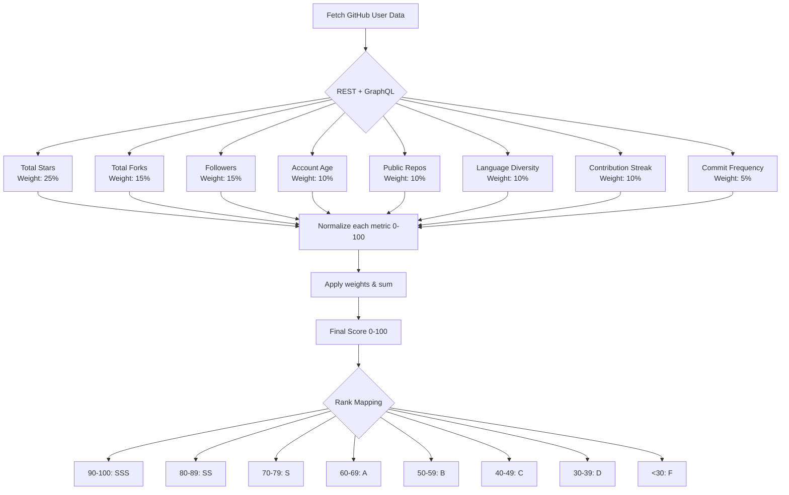
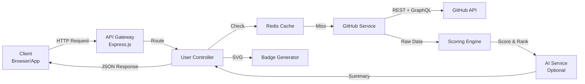

<!-- Improved Header with Animated Badges -->
<div align="center">
  
  
*Smart GitHub Profile Analyzer & Scoring Engine*
  
[](https://github.com/Shineii86/GitHubAPI)
[](https://vercel.com)
[](LICENSE)
[](https://github.com/Shineii86/GitHubAPI/pulls)
[](https://vercel.com/new/clone?repository-url=https://github.com/Shineii86/GitHubAPI)
[](https://github.com/codespaces/new?repo=Shineii86/GitHubAPI)

[](https://githubsmartapi.vercel.app/)
  
[](https://github.com/Shineii86/AlisaReactionBot/stargazers) [](https://github.com/Shineii86/GitHubAPI/fork)
[](https://github.com/Shineii86/GitHubAPI/issues)
</div>

---

## 📖 Table of Contents

- [🧠 Overview](#-overview)
- [✨ Features](#-features)
- [🎥 Live API Preview](#-live-api-preview)
- [📊 Scoring System](#-scoring-system)
- [🚀 Quick Start](#-quick-start)
- [📡 API Documentation](#-api-documentation)
  - [Get User Analysis](#get-apiuserusername)
  - [Compare Users](#get-apicompareuser1user2)
  - [SVG Badge](#get-apibadgeusername)
  - [Profile Card](#get-apicardusername)
- [💻 Code Examples](#-code-examples)
- [🛠️ Tech Stack](#️-tech-stack)
- [🏗️ Architecture](#️-architecture)
- [⚙️ Configuration](#️-configuration)
- [☁️ Deployment](#️-deployment)
- [🤝 Contributing](#-contributing)
- [💳 Support & Sponsorship](#-support--sponsorship)
- [📄 License](#-license)

---

## 🧠 Overview

**GitHubAPI** transforms raw GitHub data into actionable developer insights. It combines **REST + GraphQL** endpoints, calculates a weighted **developer score (0–100)**, assigns a **rank (D to SSS)**, tracks contribution streaks, analyzes languages, and optionally provides **AI‑powered summaries**.

Perfect for:
- 📈 Portfolio reviews & resume boosting
- 🧑‍💻 Candidate screening & technical recruiting
- 🏆 Developer leaderboards & gamification
- 🖼️ Dynamic GitHub README badges & profile cards

---

## ✨ Features

| Feature | Description | Emoji |
|---------|-------------|-------|
| **Advanced Scoring** | 8 metrics → 0–100 score + rank (D–SSS) | 🧮 |
| **Contribution Streak** | Real current & longest streak from GraphQL calendar | 🔥 |
| **AI Summaries** | GPT‑4o mini strengths/weaknesses analysis (optional) | 🤖 |
| **Compare Users** | Side‑by‑side comparison of two developers | ⚖️ |
| **SVG Badge** | Embeddable badge for GitHub profiles / READMEs | 🖼️ |
| **Profile Card** | Beautiful animated SVG profile card with avatar & stats | 🃏 |
| **Redis Caching** | 5‑minute cache to reduce API calls (optional) | 🗄️ |
| **Serverless Ready** | Deploy to Vercel in one click | 🌐 |

---

## 🎥 Live API Preview

> **Try the API instantly without writing any code!**  
> 👉 [**Launch Interactive API Preview**](https://githubsmartapi.vercel.app)

The live preview tool (included in this repo at `/public/preview.html`) lets you:
- Enter any GitHub username and see the full JSON response
- Compare two users side‑by‑side
- Copy cURL commands
- View formatted response with syntax highlighting

---

## 📊 Scoring System

The developer score is calculated using 8 weighted metrics. Below is the scoring flow:



---

## 🚀 Quick Start

### Prerequisites

- Node.js 18+  
- GitHub [Personal Access Token](https://github.com/settings/tokens) (classic) with `repo` and `user` scopes  
- (Optional) Redis server / Upstash account  
- (Optional) OpenAI API key

### Installation

```bash
# Clone the repository
git clone https://github.com/Shineii86/GitHubAPI.git
cd GitHubAPI

# Install dependencies
npm install

# Copy environment variables
cp .env.example .env

# Edit .env with your tokens
nano .env

# Start development server
npm run dev
```

---

## 📡 API Documentation

All endpoints return JSON unless specified otherwise.

### `GET /api/user/:username`

Returns complete profile analysis with score, rank, stats, and optional AI summary.

**Path parameter:**  
- `username` – GitHub username (e.g., `octocat`)

**Example request:**
```bash
curl https://githubsmartapi.vercel.app/api/user/octocat
```

**Example response:**
```json
{
  "username": "octocat",
  "score": 68,
  "rank": "B",
  "profile": {
    "followers": 5,
    "publicRepos": 8,
    "accountAgeYears": 12
  },
  "stats": {
    "totalStars": 12,
    "totalRepos": 8,
    "activeRepos": 3,
    "totalContributions": 243,
    "currentStreak": 2,
    "longestStreak": 7
  },
  "topLanguages": {
    "JavaScript": 4,
    "Ruby": 1
  },
  "aiSummary": "Moderate activity with room for growth. Good language diversity.",
  "fetchedAt": "2026-04-04T12:00:00.000Z",
  "cached": false
}
```

### `GET /api/compare/:user1/:user2`

Returns side‑by‑side comparison.

**Example:**
```bash
curl https://githubsmartapi.vercel.app/api/compare/octocat/gaearon
```

### `GET /api/badge/:username`

Returns an SVG badge (username, rank, score) for embedding.

**Example markdown:**
```markdown

```

### `GET /api/card/:username`

Returns an animated SVG profile card.

| Query param | Values | Default | Description |
|-------------|--------|---------|-------------|
| `theme` | `dark`, `light` | `dark` | Colour scheme |
| `animated` | `true`, `false` | `false` | Fade‑in animation |

**Example:**
```markdown

```

---

## 💻 Code Examples

### JavaScript (fetch)

```javascript
async function getUserAnalysis(username) {
  const response = await fetch(`https://githubsmartapi.vercel.app/api/user/${username}`);
  const data = await response.json();
  console.log(`${data.username} has score ${data.score} (rank ${data.rank})`);
}
getUserAnalysis('octocat');
```

### Python

```python
import requests

def get_github_score(username):
    url = f"https://githubsmartapi.vercel.app/api/user/{username}"
    response = requests.get(url)
    data = response.json()
    print(f"{data['username']}: {data['score']} points - Rank {data['rank']}")

get_github_score('octocat')
```

### cURL with jq

```bash
curl -s https://githubsmartapi.vercel.app/api/user/octocat | jq '.score, .rank'
```

---

## 🛠️ Tech Stack

| Category       | Technology | Badge |
|----------------|------------|-------|
| Runtime        | Node.js 18+ |  |
| Framework      | Express.js |  |
| API Clients    | Axios + GraphQL |  |
| AI Integration | OpenAI (GPT‑4o mini) |  |
| Caching        | Redis (ioredis) |  |
| Deployment     | Vercel / Docker |  |

---

## 🏗️ Architecture



---

## ⚙️ Configuration

### `.env.example`

```ini
# Server
PORT=3000

# GitHub (required)
GITHUB_TOKEN=your_github_personal_access_token

# OpenAI (optional – removes AI summary if missing)
OPENAI_API_KEY=your_openai_api_key

# Redis (optional – caching disabled if missing)
REDIS_URL=redis://localhost:6379
```

---

## ☁️ Deployment

### Deploy to Vercel (one click)

[](https://vercel.com/new/clone?repository-url=https://github.com/Shineii86/GitHubAPI)

### Deploy with Docker

```dockerfile
FROM node:18-alpine
WORKDIR /app
COPY package*.json ./
RUN npm ci --only=production
COPY . .
EXPOSE 3000
CMD ["node", "src/app.js"]
```

```bash
docker build -t githubapi .
docker run -p 3000:3000 --env-file .env githubapi
```

---

## 🤝 Contributing

We welcome contributions! Please see [CONTRIBUTING.md](CONTRIBUTING.md) and our [Code of Conduct](CODE_OF_CONDUCT.md).

1. **Fork** the repo
2. Create a **feature branch**: `git checkout -b feat/amazing-feature`
3. **Commit** changes: `git commit -m 'Add amazing feature'`
4. **Push** to branch: `git push origin feat/amazing-feature`
5. Open a **Pull Request**

---

## 💳 Support & Sponsorship

If you find this project useful, consider supporting it. Your contribution helps maintain servers, add new features, and keep the API free.

**GitHub Sponsors** | [Sponsor on GitHub](https://github.com/sponsors/Shineii86)

> Your support is greatly appreciated!

---

## 📄 License

Distributed under the **MIT License**. See `LICENSE` for more information.

---

## 💕 Loved My Work?

🚨 [Follow me on GitHub](https://github.com/Shineii86)

⭐ [Give a star to this project](https://github.com/Shineii86/Telegram-Card/)

<div align="center">

<a href="https://github.com/Shineii86/Telegram-Card">

</a>
  
  *For inquiries or collaborations*
     
[](https://telegram.me/Shineii86 "Contact on Telegram")
[](https://instagram.com/ikx7.a "Follow on Instagram")
[](https://pinterest.com/ikx7a "Follow on Pinterest")
[](mailto:ikx7a@hotmail.com "Send an Email")

  <sup><b>Copyright © 2026 <a href="https://telegram.me/Shineii86">Shinei Nouzen</a> All Rights Reserved</b></sup>


  
</div>
